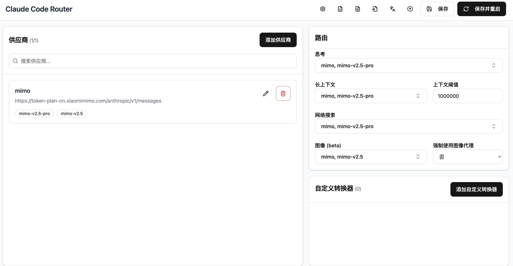

# 配置 CCR 解决 mimo-v2.5-pro 非 MLLM 输入图片报错

> **适用范围：** 本方案适用于已开通 **MiMo Token-Plan** 的用户。支持 **macOS / Ubuntu / Windows** 三平台。

---

## 项目简介

当 Claude Code 接入小米 MiMo Token-Plan 的 `mimo-v2.5-pro` 模型时，由于该模型不支持图片输入（非 MLLM），用户粘贴或发送图片会直接报错。

本项目通过 [Claude Code Router (CCR)](https://github.com/musistudio/claude-code-router) 作为本地代理层进行智能路由，并配合 `mimo-image-recognition` MCP Server 实现图片识别，从根本上解决此问题。

---

## 快速安装

```bash
# 1. 安装 CCR
npm install -g @musistudio/claude-code-router

# 2. 创建配置目录
mkdir -p ~/.claude-code-router ~/.config/mimo

# 3. 写入 CCR 配置（见下方详细步骤）
# 4. 写入环境变量文件（见下方详细步骤）
# 5. 将 Shell 自动启动代码添加到你的 rc 文件
```

> 详细配置步骤请参阅下方完整文档。

---

## 问题背景

MiMo Token-Plan 提供了多个模型，其中：

| 模型 | 类型 | 多模态 (MLLM) |
|------|------|:---:|
| `mimo-v2.5-pro` | 文本推理（主力模型） | ❌ |
| `mimo-v2.5` | 文本推理 | ❌ |
| `mimo-v2.5-asr` | 语音识别 | - |
| `mimo-v2.5-tts-voiceclone` | 语音克隆 | - |

**核心问题：** `mimo-v2.5-pro` 不支持图片输入，当 Claude Code 用户粘贴/发送图片时，API 会返回报错（类似 `max_tokens out of supported range` 或图片格式不支持）。

## 解决方案：Claude Code Router (CCR)

通过 **CCR** 作为本地代理层，在 Claude Code 和 MiMo API 之间做智能路由：

- **文本请求** → 转发给 `mimo-v2.5-pro`（主力模型）
- **图片请求** → 路由到 `mimo-v2.5`（虽然也不是 MLLM，但配合 MCP 图片识别工具可以工作）

同时配合 **mimo-image-recognition MCP Server** 作为图片理解的实际执行者。

## 架构图

```
┌─────────────────┐
│  Claude Code    │  用户交互层
│  (CLI / IDE)    │
└────────┬────────┘
         │ 所有 API 请求
         ▼
┌─────────────────┐
│  CCR (本地代理)  │  http://127.0.0.1:3456
│  智能路由层      │
└──┬──────────┬───┘
   │          │
   │ 文本请求  │ 图片请求
   ▼          ▼
┌──────────┐ ┌──────────────┐
│mimo-v2.5 │ │mimo-v2.5     │  (CCR 路由目标)
│  -pro    │ │              │
└──────────┘ └──────────────┘
                    │
                    │ 图片理解调用
                    ▼
           ┌──────────────┐
           │ MIMO MCP     │  mimo-image-recognition
           │ 图片识别服务  │  (实际 MLLM 能力)
           └──────────────┘
```
CCR Web UI 可视化配置（通过 `ccr ui` 打开）：



---

## 配置步骤

### Step 1：安装 CCR

```bash
# 通过 npm 全局安装（需要 Node.js）
npm install -g @musistudio/claude-code-router

# 验证安装
ccr -v
# 输出: 2.0.0 (或更高版本)
```

> 如果使用 `mise` 管理 Node.js，安装路径为 `~/.local/share/mise/installs/node/<version>/lib/node_modules/@musistudio/claude-code-router/`

### Step 2：配置 CCR（config.json）

配置文件路径：`~/.claude-code-router/config.json`

```json
{
  "LOG": false,
  "LOG_LEVEL": "info",
  "HOST": "127.0.0.1",
  "PORT": 3456,
  "API_TIMEOUT_MS": 600000,
  "NON_INTERACTIVE_MODE": false,
  "Providers": [
    {
      "name": "mimo",
      "api_base_url": "https://token-plan-cn.xiaomimimo.com/anthropic/v1/messages",
      "api_key": "$ANTHROPIC_API_KEY",
      "models": [
        "mimo-v2.5-pro",
        "mimo-v2.5"
      ],
      "transformer": {
        "use": [
          "Anthropic"
        ]
      }
    }
  ],
  "Router": {
    "default": "mimo,mimo-v2.5-pro",
    "background": "mimo,mimo-v2.5-pro",
    "think": "mimo,mimo-v2.5-pro",
    "longContext": "mimo,mimo-v2.5-pro",
    "longContextThreshold": 1000000,
    "webSearch": "mimo,mimo-v2.5-pro",
    "image": "mimo,mimo-v2.5"
  },
  "CUSTOM_ROUTER_PATH": "/Users/<你的用户名>/.claude-code-router/custom-router.js"
}
```

**关键路由规则：**

| 路由类型 | 目标模型 | 说明 |
|---------|---------|------|
| `default` | `mimo-v2.5-pro` | 默认文本请求 |
| `background` | `mimo-v2.5-pro` | 后台任务 |
| `think` | `mimo-v2.5-pro` | 深度思考 |
| `longContext` | `mimo-v2.5-pro` | 长上下文（阈值 1M tokens） |
| `webSearch` | `mimo-v2.5-pro` | 网页搜索 |
| **`image`** | **`mimo-v2.5`** | **图片请求 → 路由到支持图片的模型** |

### Step 3：配置 MiMo API 密钥

根据你的操作系统选择对应方式存储 API 密钥（只需执行一次）：

#### macOS — Keychain

```bash
security add-generic-password -a "$USER" -s "mimo_api_key" -w "你的API密钥" -U
```

#### Ubuntu / Linux — secret-tool（gnome-keyring）

```bash
# 需要安装 libsecret：sudo apt install libsecret-tools
secret-tool store --label="mimo_api_key" service mimo_api_key username "$USER"
# 然后输入你的 API 密钥
```

#### Windows — 用户环境变量

```powershell
# PowerShell 中执行（无需管理员权限）
[Environment]::SetEnvironmentVariable("MIMO_API_KEY", "你的API密钥", "User")
```

> 也可以使用 `cmdkey`：`cmdkey /add:mimo_api_key /user:"%USERNAME%" /pass:"你的API密钥"`

Shell 环境变量会在 Step 5 中自动从对应位置读取密钥。

### Step 4：配置 MCP 图片识别服务

配置文件路径：`~/.claude/.mcp.json`

```json
{
  "mcpServers": {
    "mimo-image-recognition": {
      "command": "uvx",
      "args": [
        "--refresh",
        "mimo-image-recognition-mcp"
      ],
      "env": {
        "MIMO_API_KEY": "你的API密钥",
        "MIMO_API_BASE": "https://token-plan-cn.xiaomimimo.com/v1",
        "MIMO_MODEL": "mimo-v2.5"
      }
    }
  }
}
```

> 这个 MCP Server 是图片理解的实际执行者。当 Claude Code 遇到图片时，CCR 路由 + MCP 工具协同工作完成图片识别。

### Step 5：Shell 自动启动配置

根据你的操作系统和 Shell，在对应的配置文件中添加以下内容，实现 **启动 Claude 时自动启动 CCR**：

| 系统 | 默认 Shell | 配置文件 |
|------|-----------|---------|
| macOS | zsh | `~/.zshrc` |
| Ubuntu / Linux | bash | `~/.bashrc` |
| Windows (Git Bash) | bash | `~/.bashrc` |
| Windows (PowerShell) | powershell | `$PROFILE`（见下方单独说明） |

#### zsh / bash（macOS / Ubuntu / Git Bash 通用）

在你的 Shell 配置文件末尾添加：

```bash
# ============================================
# MiMo API 环境变量（按平台读取密钥）
# ============================================
[ -f "$HOME/.config/mimo/env" ] && source "$HOME/.config/mimo/env"

# ============================================
# Claude Code 模型别名与包装函数
# ============================================
[ -f "$HOME/.config/mimo/claude.zsh" ] && [ -n "$ZSH_VERSION" ] && source "$HOME/.config/mimo/claude.zsh"
[ -f "$HOME/.config/mimo/claude.bash" ] && [ -n "$BASH_VERSION" ] && source "$HOME/.config/mimo/claude.bash"

# ============================================
# CCR 自动启动：确保 Claude Code 通过 CCR 代理
# ============================================
if command -v ccr >/dev/null 2>&1; then
  ccr status 2>/dev/null | grep -q "Status: Running" || ccr restart >/dev/null 2>&1
  eval "$(ccr activate)"
fi
```

#### Windows PowerShell

在 PowerShell 配置文件中添加（通过 `notepad $PROFILE` 编辑）：

```powershell
# MiMo API 环境变量
$env:ANTHROPIC_BASE_URL = "https://token-plan-cn.xiaomimimo.com/anthropic"
$env:ANTHROPIC_API_KEY = [Environment]::GetEnvironmentVariable("MIMO_API_KEY", "User")
$env:ANTHROPIC_MODEL = "opus"

# 模型别名映射
$env:ANTHROPIC_DEFAULT_OPUS_MODEL = "mimo-v2.5-pro"
$env:ANTHROPIC_DEFAULT_OPUS_MODEL_NAME = "mimo-v2.5-pro"
$env:ANTHROPIC_DEFAULT_SONNET_MODEL = "mimo-v2.5"
$env:ANTHROPIC_DEFAULT_SONNET_MODEL_NAME = "mimo-v2.5"
$env:ANTHROPIC_DEFAULT_HAIKU_MODEL = "mimo-v2.5-asr"
$env:ANTHROPIC_DEFAULT_HAIKU_MODEL_NAME = "mimo-v2.5-asr"

# CCR 自动启动
if (Get-Command ccr -ErrorAction SilentlyContinue) {
    $status = ccr status 2>&1
    if ($status -notmatch "Status: Running") { ccr restart 2>$null }
    Invoke-Expression (ccr activate)
}
```

**`ccr activate` 输出的环境变量（zsh/bash/PowerShell 通用）：**

```bash
export ANTHROPIC_AUTH_TOKEN="test"
export ANTHROPIC_BASE_URL="http://127.0.0.1:3456"  # 指向 CCR 本地代理
export NO_PROXY="127.0.0.1"
export DISABLE_TELEMETRY="true"
export DISABLE_COST_WARNINGS="true"
export API_TIMEOUT_MS="600000"
unset CLAUDE_CODE_USE_BEDROCK
```

这样每次打开新终端，`claude` 命令会自动通过 CCR 代理。

### Step 6：MiMo 环境变量文件

创建 `~/.config/mimo/env`（所有平台通用，API Key 读取逻辑自动适配）：

```bash
# MiMo API settings for Claude Code.
export ANTHROPIC_BASE_URL="https://token-plan-cn.xiaomimimo.com/anthropic"
export ANTHROPIC_MODEL="opus"

# 模型别名映射
export ANTHROPIC_DEFAULT_OPUS_MODEL="mimo-v2.5-pro"
export ANTHROPIC_DEFAULT_OPUS_MODEL_NAME="mimo-v2.5-pro"
export ANTHROPIC_DEFAULT_OPUS_MODEL_DESCRIPTION="MiMo Token-Plan Pro"
export ANTHROPIC_DEFAULT_OPUS_MODEL_SUPPORTED_CAPABILITIES="effort,xhigh_effort,thinking,adaptive_thinking,interleaved_thinking"

export ANTHROPIC_DEFAULT_SONNET_MODEL="mimo-v2.5"
export ANTHROPIC_DEFAULT_SONNET_MODEL_NAME="mimo-v2.5"
export ANTHROPIC_DEFAULT_SONNET_MODEL_DESCRIPTION="MiMo Token-Plan"
export ANTHROPIC_DEFAULT_SONNET_MODEL_SUPPORTED_CAPABILITIES="effort,xhigh_effort,thinking,adaptive_thinking,interleaved_thinking"

export ANTHROPIC_DEFAULT_HAIKU_MODEL="mimo-v2.5-asr"
export ANTHROPIC_DEFAULT_HAIKU_MODEL_NAME="mimo-v2.5-asr"
export ANTHROPIC_DEFAULT_HAIKU_MODEL_DESCRIPTION="MiMo Token-Plan ASR"

export ANTHROPIC_CUSTOM_MODEL_OPTION="mimo-v2.5-tts-voiceclone"
export ANTHROPIC_CUSTOM_MODEL_OPTION_NAME="mimo-v2.5-tts-voiceclone"
export ANTHROPIC_CUSTOM_MODEL_OPTION_DESCRIPTION="MiMo Token-Plan TTS Voice Clone"

# ============================================
# 跨平台 API Key 读取（按优先级自动选择）
# ============================================
_mimo_api_key=""

# 1. macOS: Keychain
if [ -z "$_mimo_api_key" ] && [ "$(uname -s)" = "Darwin" ] && command -v security >/dev/null 2>&1; then
  _mimo_api_key="$(security find-generic-password -a "$USER" -s "mimo_api_key" -w 2>/dev/null || true)"
fi

# 2. Linux: secret-tool (gnome-keyring)
if [ -z "$_mimo_api_key" ] && [ "$(uname -s)" = "Linux" ] && command -v secret-tool >/dev/null 2>&1; then
  _mimo_api_key="$(secret-tool lookup service mimo_api_key username "$USER" 2>/dev/null || true)"
fi

# 3. Windows (Git Bash / MSYS2): cmdkey 或环境变量
if [ -z "$_mimo_api_key" ] && [[ "$(uname -s)" == MINGW* || "$(uname -s)" == MSYS* || "$(uname -s)" == CYGWIN* ]]; then
  _mimo_api_key="${MIMO_API_KEY:-}"
fi

# 4. 通用回退：环境变量（所有平台生效）
_mimo_api_key="${_mimo_api_key:-${MIMO_API_KEY:-}}"

if [ -n "$_mimo_api_key" ]; then
  export ANTHROPIC_API_KEY="$_mimo_api_key"
fi
unset _mimo_api_key
```

### Step 7：Claude Code 权限配置

配置文件路径：`~/.claude/settings.local.json`

```json
{
  "permissions": {
    "allow": [
      "mcp__mimo-image-recognition__understand_image"
    ]
  }
}
```

这样 MCP 图片识别工具会被自动授权，无需每次手动确认。

---

## Web UI 配置方式

CCR 提供了可视化 Web 界面：

```bash
# 打开 Web UI
ccr ui
```

浏览器会打开 `http://127.0.0.1:3456`，在页面上可以：

1. **查看 CCR 运行状态**（端口、进程、路由规则）
2. **编辑 Providers**（添加/修改 API 端点和模型列表）
3. **编辑 Router 规则**（拖拽式配置各类型请求的路由目标）
4. **查看请求日志**（实时查看 API 转发情况，需先开启 LOG）
5. **管理 Presets**（导出/导入配置方案）

---

## 日常管理命令

```bash
# 查看状态
ccr status

# 启动/停止/重启
ccr start
ccr stop
ccr restart

# 查看日志（排错用）
tail -f ~/.claude-code-router/logs/ccr-*.log

# 临时开启调试日志：修改 config.json 中 LOG 为 true，LOG_LEVEL 为 "debug"

# 模型选择（交互式）
ccr model

# 直接通过 CCR 启动 Claude
ccr code "你的提示词"
```
---

## 自定义路由（可选）

如果需要更复杂的路由逻辑，可以编辑 `~/.claude-code-router/custom-router.js`：

```javascript
module.exports = async function router(req) {
  // 自定义路由逻辑
  // 返回 null 使用默认路由，返回 "provider,model" 覆盖路由
  if (!req.sessionId) {
    const headerSessionId = req.headers?.["x-claude-code-session-id"];
    if (typeof headerSessionId === "string" && headerSessionId) {
      req.sessionId = headerSessionId;
    }
  }
  return null; // 使用 config.json 中的默认路由
};
```
---

## 验证配置

```bash
# 1. 确认 CCR 运行中
ccr status
# 期望: ✅ Status: Running, Port: 3456

# 2. 确认环境变量已生效
echo $ANTHROPIC_BASE_URL
# 期望: http://127.0.0.1:3456

# 3. 启动 Claude Code 并测试图片识别
claude
# 在对话中粘贴一张图片，应该能正常识别
```
---

## 文件清单

| 文件 | 作用 | 平台 |
|------|------|------|
| `~/.claude-code-router/config.json` | CCR 主配置（Provider、Router、端口） | 全平台 |
| `~/.claude-code-router/custom-router.js` | 自定义路由逻辑 | 全平台 |
| `~/.claude/.mcp.json` | MCP Server 配置（图片识别） | 全平台 |
| `~/.claude/settings.json` | Claude Code 全局设置（模型映射） | 全平台 |
| `~/.claude/settings.local.json` | Claude Code 本地权限设置 | 全平台 |
| `~/.config/mimo/env` | MiMo API 环境变量 + 跨平台密钥读取 | 全平台 |
| `~/.config/mimo/claude.zsh` | Claude 命令包装函数 | macOS / zsh |
| `~/.config/mimo/claude.bash` | Claude 命令包装函数 | Ubuntu / Git Bash |
| `~/.zshrc` | Shell 启动配置（CCR 自动激活） | macOS |
| `~/.bashrc` | Shell 启动配置（CCR 自动激活） | Ubuntu / Git Bash |
| `$PROFILE` | PowerShell 启动配置（CCR 自动激活） | Windows |
| `~/.claude/CLAUDE.md` | Claude Code 行为指令（MCP 工具优先级） | 全平台 |

---

## 排错

| 问题 | 排查方法 |
|------|---------|
| CCR 未启动 | `ccr restart` |
| 图片仍然报错 | 检查 `config.json` 中 `Router.image` 是否为 `"mimo,mimo-v2.5"` |
| API Key 无效（macOS） | `security find-generic-password -a "$USER" -s "mimo_api_key" -w` 测试 |
| API Key 无效（Ubuntu） | `secret-tool lookup service mimo_api_key username "$USER"` 测试；未安装则 `sudo apt install libsecret-tools` |
| API Key 无效（Windows） | `[Environment]::GetEnvironmentVariable("MIMO_API_KEY", "User")` 测试 |
| MCP 工具不触发 | 检查 `~/.claude/.mcp.json` 配置，确认 `uvx` 可用 |
| 端口冲突 | 修改 `config.json` 中的 `PORT`，同步修改 `ccr activate` 输出 |
| 请求超时 | 增大 `API_TIMEOUT_MS`（当前 600000ms = 10分钟） |
| Ubuntu 无 gnome-keyring | `sudo apt install libsecret-tools` 安装 `secret-tool` |
| Windows PowerShell 被禁止运行 | 以管理员运行 `Set-ExecutionPolicy RemoteSigned -Scope CurrentUser` |
| Git Bash 中 `ccr activate` 不生效 | 确认 Node.js 在 PATH 中，或用 `npx @musistudio/claude-code-router` 替代 |

---

> **备注：** 当前方案中，CCR 的 `image` 路由指向 `mimo-v2.5`，该模型本身也不是 MLLM。实际的图片理解能力由 MCP Server（`mimo-image-recognition-mcp`）提供。CCR 的核心价值在于：让 Claude Code 的所有请求（包括图片）都能正确转发到 MiMo API，不因模型不支持图片格式而直接报错。
